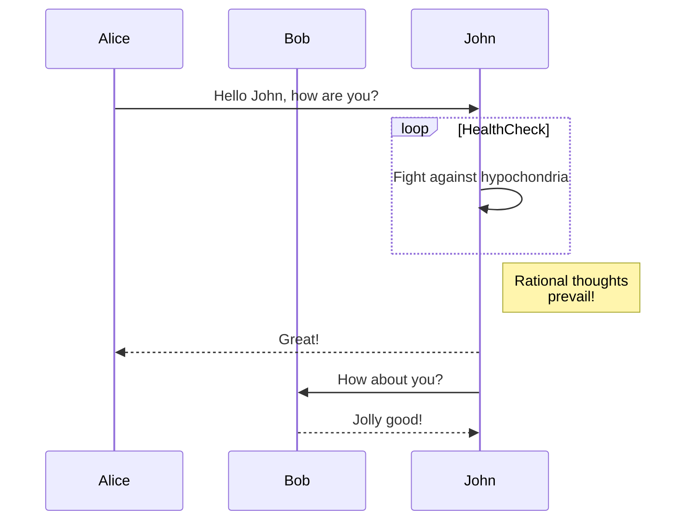

## 1. Introducción: Hacia la Soberanía de la Identidad Digital

Esta extensión ha sido diseñada para generar contraseñas mediante un algoritmo criptográfico robusto. Surge como respuesta a la problemática actual de las herramientas web de terceros (SaaS), las cuales, aunque capaces de generar claves complejas, presentan vulnerabilidades arquitectónicas inherentes al ser susceptibles de interceptación y persistencia no deseada en registros (*logs*).

> **SaaS (Software as a Service)**
> Modelo de distribución de software donde las aplicaciones se alojan en servidores remotos de un proveedor y los usuarios acceden a ellas a través de Internet, perdiendo el control sobre la infraestructura.

Este proyecto aborda y resuelve dos vulnerabilidades sistémicas en las soluciones convencionales:

1. **Baja Entropía y Determinismo:** La dependencia común de algoritmos pseudoaleatorios estándar facilita la predicción estadística, permitiendo a un atacante deducir la contraseña mediante criptoanálisis básico.
2. **Riesgo de Interceptación y Persistencia (Data Exposure):**
El uso de generadores basados en servidor ("Server-Side") obliga a transmitir las credenciales recién generadas a través de la red. Esto expone el dato en dos puntos críticos de fallo:

* **Interceptación en Tránsito:** Vulnerabilidad ante ataques *Man-in-the-Middle* (MitM) o compromiso de certificados TLS.

> **Man-in-the-Middle (MitM)**
> Ciberataque donde un actor malicioso se interpone secretamente en la comunicación entre el emisor y el receptor para espiar o modificar sus datos en tiempo real.

> **TLS (Transport Layer Security)**
> Protocolo criptográfico que garantiza la privacidad e integridad de las comunicaciones en Internet, cifrando el canal para evitar escuchas no autorizadas.

* **Persistencia en Logs:** La posibilidad técnica de que el servidor remoto almacene la contraseña en sus registros de acceso o bases de datos, ya sea por malicia o por configuraciones de depuración negligentes.

> **Server Logs**
> Archivos generados automáticamente por los servidores que documentan cronológicamente todas las peticiones, eventos y errores. Si una credencial viaja en la URL o el cuerpo de la petición, queda grabada permanentemente en texto plano.

### Propuesta Arquitectónica: Ejecución Local Estricta

Para erradicar la dependencia de terceros, proponemos una arquitectura de **ejecución exclusiva en el cliente ("Client-Side Only")**. A diferencia de las soluciones web tradicionales que delegan el procesamiento a un *backend*, esta extensión transfiere la integridad de la carga computacional al entorno local del navegador.

> **Client-Side Only**
> Modelo de arquitectura donde el 100% de la lógica y el procesamiento de datos ocurre en el dispositivo del usuario (navegador). A diferencia del modelo cliente-servidor, aquí ningún dato viaja a la nube, garantizando soberanía total sobre la información.

Esta autonomía se consigue mediante la implementación de un entorno de ejecución aislado que gestiona la lógica de la aplicación:

1. **Privacidad por Diseño:** Se garantiza un ciclo de vida efímero para los datos. La contraseña se genera y visualiza en la interfaz temporalmente; una vez que el elemento visual (Popup) se cierra, la información se purga inmediatamente de la memoria RAM del dispositivo.

> **Forensic RAM Scraping**
> Técnica forense utilizada para recuperar fragmentos de datos que persisten en la memoria volátil (RAM) del ordenador. Al gestionar explícitamente el ciclo de vida de las variables y limpiarlas tras su uso, mitigamos este riesgo.

1. **Ausencia de Telemetría:** Se elimina cualquier comunicación con APIs externas. El software opera bajo el principio de **Zero-Knowledge**; ni el desarrollador ni el proveedor del navegador poseen acceso a las credenciales generadas.

> **Zero-Knowledge (Conocimiento Cero)**
> Principio de seguridad donde el sistema está diseñado matemáticamente para que el proveedor del servicio no tenga ninguna capacidad técnica para acceder o descifrar los datos del usuario.

## 2. Arquitectura Criptográfica y Calidad de la Aleatoriedad

El diseño de este sistema rompe con las implementaciones de software convencionales para adherirse a estándares de seguridad ofensiva. El núcleo del desarrollo se centra no solo en obtener números al azar, sino en asegurar que estos sean matemáticamente imposibles de anticipar.

### 2.1. Definición de Estándares: PRNG vs CSPRNG

Para comprender la justificación técnica de esta extensión, es fundamental distinguir entre los dos mecanismos de generación disponibles en los motores JavaScript modernos:

* **Math.random() (PRNG):** Es un Generador de Números Pseudoaleatorios. Funciona mediante una fórmula matemática fija. Si un atacante descubre el estado interno del algoritmo (la "semilla"), puede calcular matemáticamente todos los valores futuros.

> **PRNG (Pseudo-Random Number Generator)**
> Algoritmo determinista. Dado un estado inicial (semilla), la secuencia de números producida es siempre idéntica. Es eficiente para simulaciones, pero inseguro para criptografía.

* **window.crypto (CSPRNG):** Es un Generador de Números Aleatorios Criptográficamente Seguro. No depende de una fórmula aislada, sino que actúa como una interfaz hacia el **recolector de entropía del sistema operativo**. Se alimenta de datos físicos impredecibles.

> **CSPRNG (Cryptographically Secure Pseudo-Random Number Generator)**
> Algoritmo diseñado para resistir la ingeniería inversa. Utiliza fuentes de alta entropía (ruido térmico, interrupciones de hardware) para garantizar la impredecibilidad.

### 2.2. Análisis Comparativo

La siguiente tabla detalla por qué abandonar el estándar `Math.random` es la decisión arquitectónica más crítica del proyecto:

#### Tabla 1. Comparativa de Algoritmos de Generación

| Característica Técnica | Enfoque Estándar (Inseguro) | Enfoque Implementado (Seguro) |
| --- | --- | --- |
| **Función Base** | `Math.random()` | `window.crypto.getRandomValues()` |
| **Clasificación** | PRNG (Pseudo-Aleatorio) | CSPRNG (Criptográficamente Seguro) |
| **Fuente de Entropía** | Algoritmo matemático + Semilla | Ruido de Hardware (Caos del sistema) |
| **Predictibilidad** | **Alta.** Si se conoce la semilla. | **Nula.** Estadísticamente impredecible. |
| **Vector de Ataque** | Predicción de secuencia. | Ninguno conocido factible actualmente. |

### 2.3. Distribución Uniforme y Eliminación de Sesgos

La seguridad no termina en la generación del número aleatorio; la conversión de ese número en un carácter legible (A-Z, 0-9) presenta su propio desafío matemático conocido como **"Modulo Bias"**.

> **Modulo Bias (Sesgo de Módulo)**
> Error estadístico que ocurre al usar una división simple (`%`) para mapear un rango grande de números aleatorios a un conjunto pequeño de caracteres. Si el rango total no es un múltiplo exacto del conjunto de destino, los primeros caracteres tendrán matemáticamente mayor probabilidad de aparecer.

Muchas implementaciones ingenuas toman un número aleatorio seguro y aplican una división simple. Si el rango de números generados (ej. 0-255 en un byte) no es un múltiplo exacto de la cantidad de caracteres disponibles (ej. 62 caracteres alfanuméricos), ciertos caracteres tendrán matemáticamente más probabilidades de salir que otros, creando un "favoritismo" estadístico que debilita la clave.

Nuestra arquitectura implementa algoritmos de rechazo (*rejection sampling*) que garantizan una **Distribución Uniforme**. Esto asegura que cada carácter posible tenga exactamente la misma probabilidad () de ser seleccionado.

**Implementación Correcta (Rejection Sampling):**

```typescript
// ✅ Seguro: Si el número aleatorio cae en la zona de sesgo, se descarta y se regenera.
// Esto elimina el "favoritismo" estadístico.
private static getSecureRandomInt(max: number): number {
    // Calculamos el límite máximo seguro que es múltiplo de 'max'
    const limit = Math.floor(0xFFFFFFFF / max) * max;
    const array = new Uint32Array(1);

    do {
        window.crypto.getRandomValues(array);
    } while (array[0] >= limit); // Rechazamos valores fuera del límite seguro

    return array[0] % max;
}

```

## 3. Protocolos de Seguridad y Privacidad

La arquitectura de seguridad se ha diseñado bajo el principio de "mínimo privilegio" y aislamiento total.

### 3.1. Aislamiento de Red y Entorno "Sandbox"

La aplicación opera bajo un modelo de **Local Execution Context**. A nivel de permisos, la extensión carece de capacidades para realizar peticiones externas (bloqueo explícito de `fetch`, `XHR` o `WebSocket` en el manifiesto).

Toda la lógica de generación ocurre dentro del *sandbox* de memoria del navegador. Esto garantiza matemáticamente que la contraseña nunca transita por la red.

> **Sandbox (Caja de Arena)**
> Mecanismo de seguridad que aísla la ejecución de un programa. Impide que, si la extensión es comprometida, el daño pueda propagarse al resto del sistema o acceder a datos fuera de su entorno asignado.

### 3.2. Endurecimiento contra Inyecciones (CSP y Manifest V3)

La extensión cumple rigurosamente con la especificación **Manifest V3** de Google, implementando una **Política de Seguridad de Contenido (CSP)** restrictiva.

* **Bloqueo de Scripts en Línea:** Se prohíbe la ejecución de código dentro del HTML (atributos `onclick` o `<script>` inline).
* **Separación de Contextos:** La lógica se inyecta exclusivamente mediante archivos externos compilados.

> **CSP (Content Security Policy)**
> Capa de seguridad adicional que ayuda a detectar y mitigar ciertos tipos de ataques, incluyendo XSS. Funciona restringiendo las fuentes de contenido ejecutable que el navegador tiene permitido cargar (ej. prohibiendo scripts externos o inline).
> **XSS (Cross-Site Scripting)**
> Vulnerabilidad que permite a un atacante inyectar scripts maliciosos en páginas web vistas por otros usuarios, permitiendo el robo de sesiones o datos sensibles.

### 3.3. Integridad de la Cadena de Suministro (Zero Dependencies)

Una vulnerabilidad crítica en el desarrollo web moderno es el **Ataque a la Cadena de Suministro** (*Supply Chain Attack*).

> **Supply Chain Attack**
> Estrategia de ciberataque que busca comprometer una organización infectando elementos de su red de proveedores. En desarrollo de software, suele implicar la inyección de código malicioso en librerías de código abierto (`npm packages`) que los desarrolladores utilizan.

Este proyecto sigue una filosofía de **"Cero Dependencias"**. El algoritmo de generación no importa librerías externas; todo el código ha sido escrito y auditado en TypeScript nativo, asegurando que no existen "cajas negras".

## 4. Resultados y Experiencia de Usuario (UX)

La implementación final resulta en una interfaz minimalista diseñada para reducir la carga cognitiva sin sacrificar potencia técnica.

Basándonos en la interfaz gráfica desarrollada, el sistema ofrece las siguientes capacidades:

* **Control Granular de Entropía:** La extensión permite al usuario definir con precisión el espacio de búsqueda (Search Space). Mediante selectores independientes, el usuario adapta la complejidad a los requisitos de cada servicio.
* **Algoritmo de Filtrado de Ambigüedad:** Lógica de saneamiento que excluye caracteres visualmente confusos (como `I` vs `l`) para evitar errores de transcripción manual, mejorando la usabilidad.
* **Feedback Visual Inmediato:** Incorporación de controles deslizantes (*sliders*) para una respuesta visual instantánea sobre la fortaleza de la clave.
* **Integración Nativa con Clipboard API:** Uso de la API asíncrona moderna (`navigator.clipboard`) para una transferencia segura a la memoria del sistema.

> **Clipboard API**
> Interfaz moderna y segura para interactuar con el portapapeles. A diferencia del obsoleto `document.execCommand`, esta API es asíncrona y requiere permisos explícitos del usuario, evitando bloqueos en la interfaz y accesos no autorizados.

## 5. Conclusión

La creación de este generador de contraseñas valida la hipótesis de que es posible, y necesario, elevar el estándar de seguridad en las herramientas de uso cotidiano.

Hemos demostrado que al sustituir la conveniencia de los generadores pseudoaleatorios (`Math.random`) por la robustez de **CSPRNG** (`window.crypto`), y al blindar la ejecución mediante una arquitectura **Offline** y **Tipado Estático** (TypeScript), se elimina la necesidad de confiar ciegamente en servicios de terceros.

El resultado es un software de "Soberanía Digital": una herramienta transparente, auditable (Open Source bajo licencia MIT) y matemáticamente segura, que devuelve al usuario el control total sobre la génesis de su identidad digital.

---

### Referencias y Documentación Técnica

* **Aleatoriedad Criptográfica:**
* [W3C Web Cryptography API - MDN Web Docs](https://developer.mozilla.org/en-US/docs/Web/API/Web_Crypto_API)
* [NIST: Random Bit Generation Standards](https://csrc.nist.gov/projects/random-bit-generation)

* **Vulnerabilidades Web:**
* [OWASP: Man-in-the-Middle (MitM) Attacks](https://owasp.org/www-community/attacks/Man-in-the-middle_attack)
* [OWASP: Supply Chain Attacks](https://owasp.org/www-project-top-10/2021/A06_2021-Vulnerable_and_Outdated_Components/)

* **Matemáticas y Algoritmos:**
* [Modulo Bias - Cryptography StackExchange](https://crypto.stackexchange.com/questions/394/how-much-bias-is-introduced-by-the-remainder-technique)


