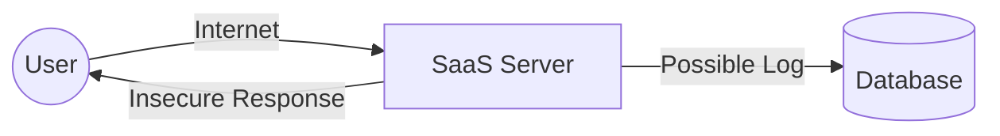
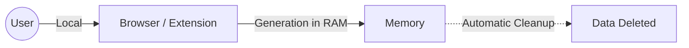
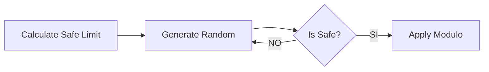

## 1. Introduction: The Problem with the “Cloud”

We live in an era of massive data leaks. However, we continue to entrust the key to our digital lives (our passwords) to third-party web tools that operate in black boxes.

This extension was created as an engineering response to that problem. We have designed a credential generator that replaces blind trust with **cryptographic guarantees**, resolving the architectural vulnerabilities of current SaaS (Software as a Service) tools.

### The Hidden Risk in the Conventional

Traditional online tools have two systemic flaws:

1. **Low Entropy:** The use of fast but predictable algorithms makes it easy for an attacker to guess patterns.
2. **Data Exposure:** When the key is generated on a remote server, it must travel over the internet to your screen.

Here we visualize the insecure flow of a traditional website:



> **SaaS (Software as a Service)**
> A distribution model where the software runs on a third-party provider's servers. When using it, you lose physical control over your data and depend on their security and intentions.

In this model, you are exposed to two critical attack vectors:

* **Interception (MitM):** If the HTTPS connection fails or is compromised, the password can be read in transit.
* **Persistence in Logs:** The server could, by mistake or malice, save your new password in a plain text log file.

---

## 2. Our Proposal: Strict Client-Side Architecture

To eradicate third-party dependency, we propose a paradigm shift: **Bring execution to the user.**

Unlike web solutions, this extension transfers all computational load to the local browser environment. The server disappears from the equation.



> **Client-Side Only (Execution in Client)**
> Architecture model where 100% of the logic and processing occurs on the user's device. No data travels to the cloud or leaves your computer, ensuring total sovereignty over the information.

### Pillars of this Architecture

1. **Privacy by Design:** The password has a short life cycle. It is generated, copied, and immediately purged from RAM (mitigating RAM scraping attacks).
2. **Zero-Knowledge:** With no server, it is mathematically impossible for us (the developers) or the browser to see or store your passwords.

---

## 3. Cryptographic Engineering: The Quality of Randomness

Not all random numbers are created equal. The core of this project is to ensure that the numbers generated are impossible to predict.

### 3.1. The Standard: Math.random vs window.crypto

Most websites use `Math.random()`, a pseudo-random number generator (PRNG) designed for video games or animations, not for security. It is deterministic: if you know the initial state, you know the future.

We implement **CSPRNG** (*Cryptographically Secure Pseudo-Random Number Generator*) through the `window.crypto` API. This API does not use simple formulas, but rather collects **entropy from the operating system** (thermal noise, mouse movement, hardware interrupts) to generate true unpredictable chaos.

### 3.2. Eliminating Statistical Bias (Modulo Bias)

A common programming mistake is to use simple division (`%`) to convert a random number into a letter. This introduces a serious mathematical problem: **Modulo Bias**.

If the range of random numbers is not an exact multiple of the available characters (A-Z, 0-9), some characters will be more likely to appear than others, weakening the password.

To solve this, we implement a **Rejection Sampling** algorithm:



> **Module Bias**
> A statistical error where certain outcomes occur more frequently due to an inaccurate division. Our algorithm detects these “unfair” numbers and discards them, ensuring a perfect **Uniform Distribution**.

#### Implementation in TypeScript

This is how we mathematically guarantee the fairness of each character:

```typescript
//Safe: If the random number falls in the bias zone, it is discarded and regenerated.
private static getSecureRandomInt(max: number): number {
    // Calculate the maximum safe limit
    const limit = Math.floor(0xFFFFFFFF / max) * max;
    const array = new Uint32Array(1);

    do {
        // Generate new entropy on each attempt
        window.crypto.getRandomValues(array);
    } while (array[0] >= limit); // REJECT: If it exceeds the limit, we repeat the loop

    return array[0] % max;
}

```

---

## 4. Additional Security Protocols

Security is not just about the algorithm, it's about the environment.

* **Sandbox & CSP:** The extension operates under a strict Content Security Policy that prohibits external connections (fetch, XHR) and the execution of inline scripts. It is a secure digital cage.
* **Zero Dependencies:** To prevent supply chain attacks, we do not use third-party libraries (`npm`). All code is native and auditable.
* **Secure Clipboard API:** We use the modern asynchronous API to manage the clipboard, avoiding the lockups and risks of older methods.

## 5. Conclusion

Replacing the convenience of the cloud with the robustness of local execution is necessary in today's environment. This generator demonstrates that it is possible to create everyday tools that respect the user's **Digital Sovereignty**: transparent code, local execution, and secure mathematics.

---

## 6. Resources and Technical Documentation

To audit the code or delve deeper into the security concepts mentioned, consult the following official sources:

* **Cryptography:** [MDN Web Crypto API](https://developer.mozilla.org/en-US/docs/Web/API/Web_Crypto_API) | [NIST Random Bit Generation](https://csrc.nist.gov/projects/random-bit-generation)
* **Security and Threats:** [OWASP MitM](https://owasp.org/www-community/attacks/Man-in-the-middle_attack) | [Supply Chain Attacks](https://owasp.org/www-project-top-10/2021/A06_2021-Vulnerable_and_Outdated_Components/) | [Content Security Policy (CSP)](https://developer.mozilla.org/es/docs/Web/HTTP/CSP) | [Manifest V3 Security](https://developer.chrome.com/docs/extensions/mv3/intro/mv3-overview#security)
* **Mathematics:** [Understanding Modulo Bias (Cryptography StackExchange)](https://crypto.stackexchange.com/questions/394/how-much-bias-is-introduced-by-the-remainder-technique)

---

### Source Code and Download

We believe in total transparency. This project is open source under the MIT license.

[View GitHub Repository](https://chromewebstore.google.com/detail/generador-de-contrase%C3%B1as/kmpakbpibkdnidnloeibnenimcijhclh?authuser=0&hl=es)
