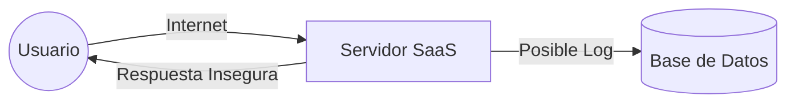
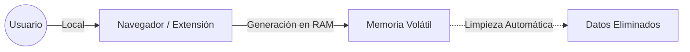
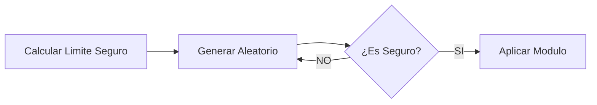

## 1. Introducción: El Problema de la "Nube"

Vivimos en una era de filtraciones masivas de datos. Sin embargo, seguimos confiando la llave de nuestra vida digital (nuestras contraseñas) a herramientas web de terceros que operan en cajas negras.

Esta extensión nace como una respuesta de ingeniería a ese problema. Hemos diseñado un generador de credenciales que sustituye la confianza ciega por **garantías criptográficas**, resolviendo las vulnerabilidades arquitectónicas de las herramientas SaaS (*Software as a Service*) actuales.

### El Riesgo Oculto en lo Convencional

Las herramientas online tradicionales presentan dos fallos sistémicos:

1. **Baja Entropía:** El uso de algoritmos rápidos pero predecibles facilita que un atacante adivine patrones.
2. **Exposición de Datos (Data Exposure):** Al generar la clave en un servidor remoto, esta debe viajar por internet hasta tu pantalla.

Aquí visualizamos el flujo inseguro de una web tradicional:



> **SaaS (Software as a Service)**
> Modelo de distribución donde el software se ejecuta en los servidores de un proveedor ajeno. Al usarlo, pierdes el control físico sobre tus datos y dependes de su seguridad e intenciones.

En este modelo, te expones a dos vectores de ataque críticos:

* **Interceptación (MitM):** Si la conexión HTTPS falla o es comprometida, la contraseña puede ser leída en tránsito.
* **Persistencia en Logs:** El servidor podría, por error o malicia, guardar tu nueva contraseña en un archivo de registro de texto plano.

---

## 2. Nuestra Propuesta: Arquitectura "Client-Side" Estricta

Para erradicar la dependencia de terceros, proponemos un cambio de paradigma: **Traer la ejecución al usuario.**

A diferencia de las soluciones web, esta extensión transfiere toda la carga computacional al entorno local del navegador. El servidor desaparece de la ecuación.



> **Client-Side Only (Ejecución en Cliente)**
> Modelo de arquitectura donde el 100% de la lógica y el procesamiento ocurre en el dispositivo del usuario. Ningún dato viaja a la nube ni sale de tu ordenador, garantizando soberanía total sobre la información.

### Pilares de esta Arquitectura

1. **Privacidad por Diseño:** La contraseña tiene un ciclo de vida efímero. Se genera, se copia y se purga inmediatamente de la memoria RAM (mitigando ataques de *RAM Scraping*).
2. **Zero-Knowledge (Conocimiento Cero):** Al no haber servidor, es matemáticamente imposible que nosotros (los desarrolladores) o el navegador veamos o almacenemos tus claves.

---

## 3. Ingeniería Criptográfica: La Calidad del Azar

No todos los números aleatorios son iguales. El núcleo de este proyecto es asegurar que los números generados sean imposibles de anticipar.

### 3.1. El Estándar: Math.random vs window.crypto

La mayoría de webs usan `Math.random()`, un generador pseudoaleatorio (PRNG) diseñado para videojuegos o animaciones, no para seguridad. Es determinista: si conoces el estado inicial, conoces el futuro.

Nosotros implementamos **CSPRNG** (*Cryptographically Secure Pseudo-Random Number Generator*) a través de la API `window.crypto`. Esta API no usa fórmulas simples, sino que recolecta **entropía del sistema operativo** (ruido térmico, movimiento del ratón, interrupciones de hardware) para generar verdadero caos impredecible.

### 3.2. Eliminando el Sesgo Estadístico (Modulo Bias)

Un error común en programación es usar una división simple (`%`) para convertir un número aleatorio en una letra. Esto introduce un problema matemático grave: el **Sesgo de Módulo**.

Si el rango de números aleatorios no es un múltiplo exacto de los caracteres disponibles (A-Z, 0-9), algunos caracteres tendrán más probabilidad de salir que otros, debilitando la contraseña.

Para solucionarlo, implementamos un algoritmo de **Rejection Sampling** (Muestreo de Rechazo):



> **Modulo Bias (Sesgo de Módulo)**
> Error estadístico donde ciertos resultados ocurren con mayor frecuencia debido a una división inexacta. Nuestro algoritmo detecta estos números "injustos" y los descarta, asegurando una **Distribución Uniforme** perfecta.

#### Implementación en TypeScript

Así es como garantizamos matemáticamente la equidad de cada carácter:

```typescript
//Seguro: Si el número aleatorio cae en la zona de sesgo, se descarta y se regenera.
private static getSecureRandomInt(max: number): number {
    // Calculamos el límite máximo seguro
    const limit = Math.floor(0xFFFFFFFF / max) * max;
    const array = new Uint32Array(1);

    do {
        // Generamos nueva entropía en cada intento
        window.crypto.getRandomValues(array);
    } while (array[0] >= limit); // RECHAZO: Si supera el límite, repetimos el bucle

    return array[0] % max;
}

```

---

## 4. Protocolos de Seguridad Adicionales

La seguridad no es solo el algoritmo, es el entorno.

* **Sandbox & CSP:** La extensión opera bajo una *Content Security Policy* estricta que prohíbe conexiones externas (`fetch`, `XHR`) y la ejecución de scripts en línea. Es una jaula digital blindada.
* **Zero Dependencies:** Para evitar ataques a la cadena de suministro (*Supply Chain Attacks*), no usamos librerías de terceros (`npm`). Todo el código es nativo y auditable.
* **Clipboard API Segura:** Usamos la API moderna asíncrona para gestionar el portapapeles, evitando los bloqueos y riesgos de los métodos antiguos.

## 5. Conclusión

Sustituir la conveniencia de la nube por la robustez de la ejecución local es necesario en el entorno actual. Este generador demuestra que es posible crear herramientas cotidianas que respeten la **Soberanía Digital** del usuario: código transparente, ejecución local y matemáticas seguras.

---

## 6. Recursos y Documentación Técnica

Para auditar el código o profundizar en los conceptos de seguridad mencionados, consulta las siguientes fuentes oficiales:

* **Criptografía:** [MDN Web Crypto API](https://developer.mozilla.org/en-US/docs/Web/API/Web_Crypto_API) | [NIST Random Bit Generation](https://csrc.nist.gov/projects/random-bit-generation)
* **Seguridad y Amenazas:** [OWASP MitM](https://owasp.org/www-community/attacks/Man-in-the-middle_attack) | [Supply Chain Attacks](https://owasp.org/www-project-top-10/2021/A06_2021-Vulnerable_and_Outdated_Components/) | [Content Security Policy (CSP)](https://developer.mozilla.org/es/docs/Web/HTTP/CSP) | [Manifest V3 Security](https://developer.chrome.com/docs/extensions/mv3/intro/mv3-overview#security)
* **Matemáticas:** [Understanding Modulo Bias (Cryptography StackExchange)](https://crypto.stackexchange.com/questions/394/how-much-bias-is-introduced-by-the-remainder-technique)

---

### Código Fuente y Descarga

Creemos en la transparencia total. Este proyecto es de código abierto bajo licencia MIT.

**[Ver Repositorio en GitHub](https://github.com/ELmoliii/generador-password)** |**[Descargar Extensión (ChromeStore)](https://chromewebstore.google.com/detail/generador-de-contrase%C3%B1as/kmpakbpibkdnidnloeibnenimcijhclh?authuser=0&hl=es)**
