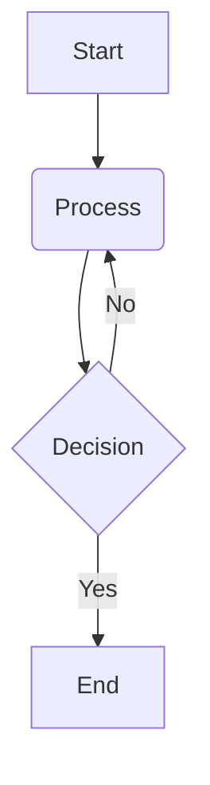
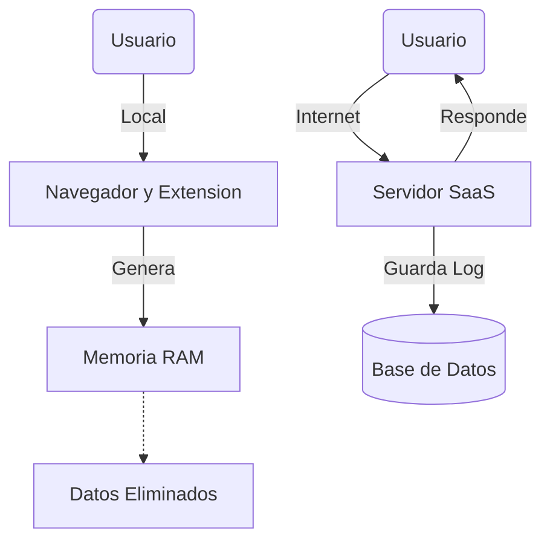

# Mermaid Diagram Test

Here is a simple flowchart:

```mermaid
graph TD
    A[Start] --> B(Process)
    B --> C{Decision}
    C -->|Yes| D[End]
    C -->|No| B
```

```mermaid
graph TD
    A1(Usuario) -->|Local| B1[Navegador y Extension]
    B1 -->|Genera| C1[Memoria RAM]
    C1 -.-> D1[Datos Eliminados]
    A2(Usuario) -->|Internet| B2[Servidor SaaS]
    B2 -->|Guarda Log| C2[(Base de Datos)]
    B2 -->|Responde| A2

```
